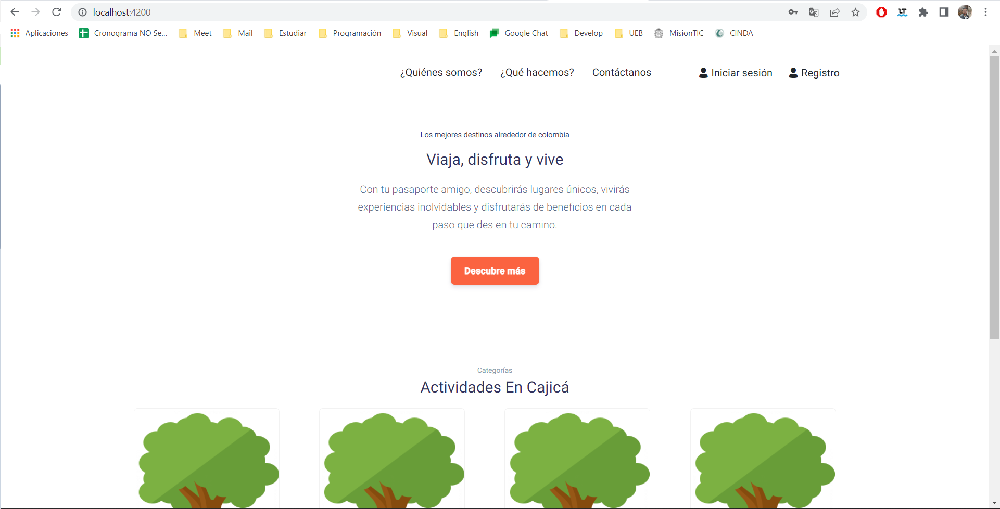
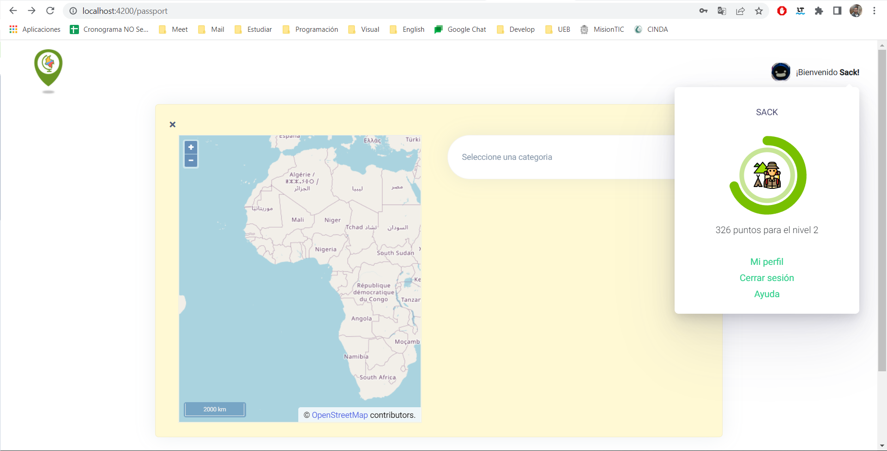

# Sabana Hack 2021-2  (by: Hackattack)

Este es un código realizado durante el Sabanahack como un simple ejemplo con la oportunidad de mejorar.

# Descripción:
La propuesta consiste en un mapa virtual que permita interesar a personas y sumergirlas en un juego de roles donde deseen conseguir insignias por recorrer lugares turísticos de la localidad. Posteriormente, estos sellos pueden usarse para un sistema de puntos parar ser redimidos con entidades aliadas.

# Pasos:
1. Clonar el repositorio
2. Ejecutar el comando "npm i"
3. Ejecutar el comando "npm start"
4. Abrir localhost:4200 (Si esta libre el puerto 4200)

# Evidencias:

